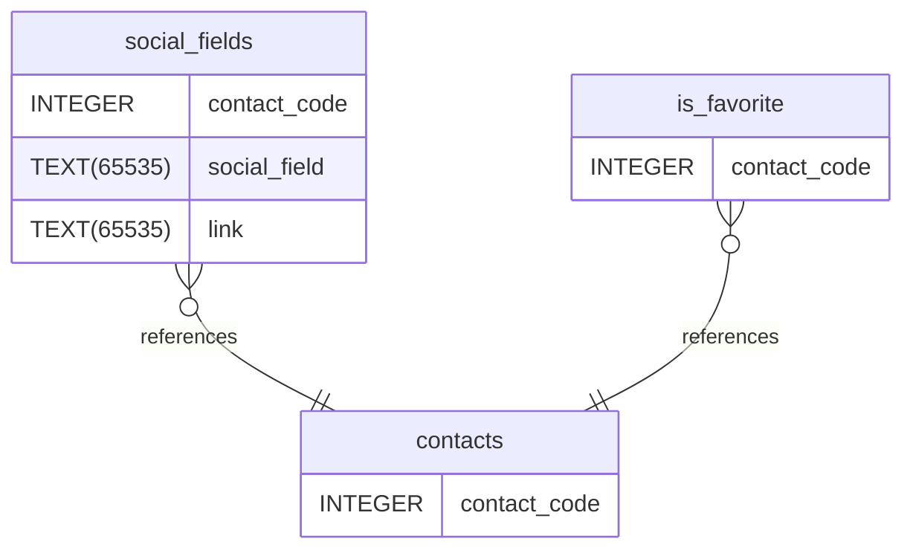

# contact_sharing documentation
## Summary

- [Introduction](#introduction)
- [Database Type](#database-type)
- [Table Structure](#table-structure)
	- [contacts](#contacts)
	- [is_favorite](#is_favorite)
	- [social_fields](#social_fields)
- [Relationships](#relationships)
- [Database Diagram](#database-diagram)

## Introduction

## Database type

- **Database system:** SQLite
## Table structure

### contacts

| Name        | Type          | Settings                      | References                    | Note                           |
|-------------|---------------|-------------------------------|-------------------------------|--------------------------------|
| **contact_code** | INTEGER | 🔑 PK, not null, unique |  | | 

### is_favorite

| Name        | Type          | Settings                      | References                    | Note                           |
|-------------|---------------|-------------------------------|-------------------------------|--------------------------------|
| **contact_code** | INTEGER | 🔑 PK, not null | is_favorite_references_contacts | | 

### social_fields

| Name        | Type          | Settings                      | References                    | Note                           |
|-------------|---------------|-------------------------------|-------------------------------|--------------------------------|
| **contact_code** | INTEGER | 🔑 PK, not null | social_fields_references_contacts | |
| **social_field** | TEXT(65535) | not null |  | |
| **link** | TEXT(65535) | not null |  | | 

## Relationships

- **social_fields to contacts**: many_to_one
- **is_favorite to contacts**: many_to_one

## Database Diagram

