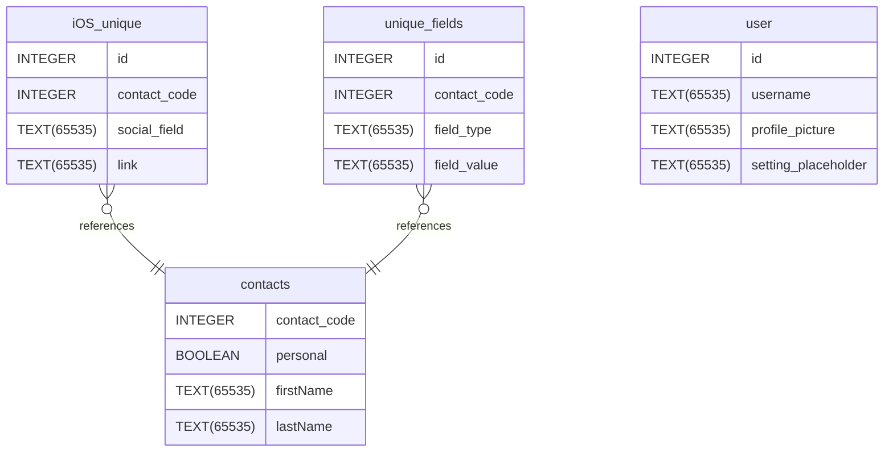

# contact_sharing documentation
## Summary

- [Introduction](#introduction)
- [Database Type](#database-type)
- [Table Structure](#table-structure)
	- [user](#user)
	- [contacts](#contacts)
	- [unique_fields](#unique_fields)
	- [iOS_unique](#ios_unique)
- [Relationships](#relationships)
- [Database Diagram](#database-diagram)

## Introduction

## Database type

- **Database system:** SQLite
## Table structure

### user

| Name        | Type          | Settings                      | References                    | Note                           |
|-------------|---------------|-------------------------------|-------------------------------|--------------------------------|
| **id** | INTEGER | 🔑 PK, not null, unique, autoincrement |  | |
| **username** | TEXT(65535) | not null |  | |
| **profile_picture** | TEXT(65535) | null |  | |
| **setting_placeholder** | TEXT(65535) | null |  | | 

### contacts

| Name        | Type          | Settings                      | References                    | Note                           |
|-------------|---------------|-------------------------------|-------------------------------|--------------------------------|
| **contact_code** | INTEGER | 🔑 PK, not null, unique |  | |
| **personal** | BOOLEAN | not null |  | |
| **firstName** | TEXT(65535) | not null |  | |
| **lastName** | TEXT(65535) | null |  | | 

### unique_fields

| Name        | Type          | Settings                      | References                    | Note                           |
|-------------|---------------|-------------------------------|-------------------------------|--------------------------------|
| **id** | INTEGER | 🔑 PK, not null, unique, autoincrement |  | |
| **contact_code** | INTEGER | not null | fk_unique_fields_contact_code_contacts | |
| **field_type** | TEXT(65535) | not null |  | |
| **field_value** | TEXT(65535) | not null |  | | 

### iOS_unique

| Name        | Type          | Settings                      | References                    | Note                           |
|-------------|---------------|-------------------------------|-------------------------------|--------------------------------|
| **id** | INTEGER | 🔑 PK, not null, unique, autoincrement |  | |
| **contact_code** | INTEGER | not null | fk_iOS_unique_contact_code_contacts | |
| **social_field** | TEXT(65535) | not null |  | |
| **link** | TEXT(65535) | not null |  | | 

## Relationships

- **iOS_unique to contacts**: many_to_one
- **unique_fields to contacts**: many_to_one

## Database Diagram

